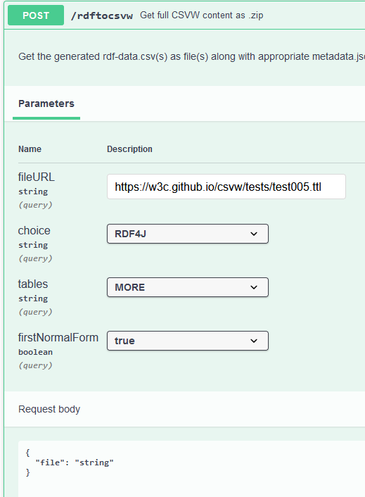
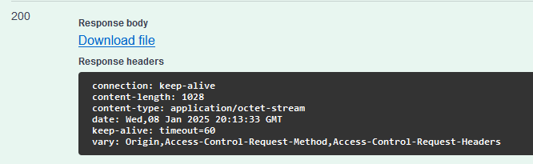
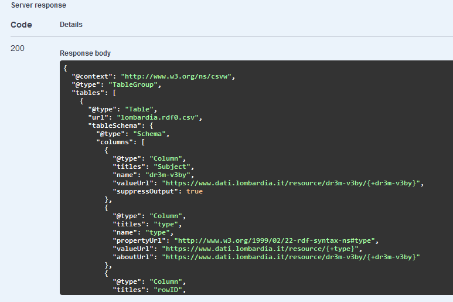
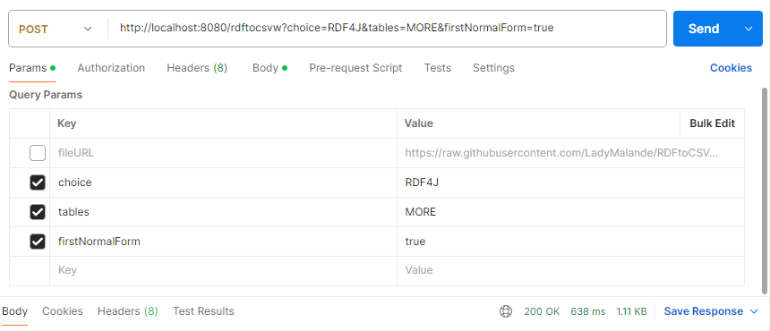
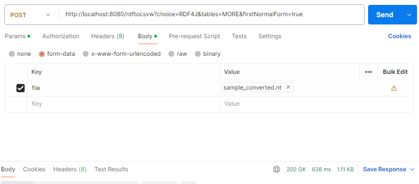

<!-- Improved compatibility of back to top link: See: https://github.com/othneildrew/Best-README-Template/pull/73 -->
<a id="readme-top"></a>
<!--
*** Thanks for checking out the Best-README-Template. If you have a suggestion
*** that would make this better, please fork the repo and create a pull request
*** or simply open an issue with the tag "enhancement".
*** Don't forget to give the project a star!
*** Thanks again! Now go create something AMAZING! :D
-->


<!-- PROJECT SHIELDS -->
<!--
*** I'm using markdown "reference style" links for readability.
*** Reference links are enclosed in brackets [ ] instead of parentheses ( ).
*** See the bottom of this document for the declaration of the reference variables
*** for contributors-url, forks-url, etc. This is an optional, concise syntax you may use.
*** https://www.markdownguide.org/basic-syntax/#reference-style-links
-->

<!-- This md template has been copied from https://github.com/othneildrew/Best-README-Template -->

<!-- PROJECT LOGO -->
<br />
<div>


<h3 align="center">RDFtoCSVWAPI</h3>

  <p align="center"> 
    RDF to CSVW data converter web service
    <br />
    <a href="https://github.com/LadyMalande/RDFtoCSV"><strong>Explore the underlying library RDFtoCSV »</strong></a>
    <br />
    <br />
    <a href="https://rdf-to-csvw.onrender.com/swagger-ui/index.html">View Live Instance</a>
    ·
   </p>
</div>


<!-- TABLE OF CONTENTS -->
<details>
  <summary>Table of Contents</summary>
  <ol>
    <li>
      <a href="#about-the-project">About The Project</a>
      <ul>
        <li><a href="#built-with">Built With</a></li>
      </ul>
    </li>
    <li>
      <a href="#getting-started">Getting Started</a>
      <ul>
        <li><a href="#prerequisites">Prerequisites</a></li>
        <li><a href="#installation">Installation</a></li>
      </ul>
    </li>
    <li><a href="#usage">Usage</a>
      <ul>
        <li><a href="#swagger-ui">Swagger UI</a></li>
        <li><a href="#curl">cURL</a></li>
      </ul>
    </li>
    <li><a href="#contact">Contact</a></li>
  </ol>
</details>


<!-- ABOUT THE PROJECT -->
## About The Project
<div id=“about-the-project”></div>
RDFtoCSVWAPI is a web service built on the RDFtoCSV library. It is a part of thesis.

It allows users to convert RDF files to CSV on the Web (CSVW). Or just its part (CSV/metadata JSON).

To try out live web service, go to: [Swagger UI RDFtoCSV](https://rdf-to-csvw.onrender.com/swagger-ui/index.html).


<p>(<a href="#readme-top">back to top</a>)</p>


### Built With
<div id=“built-with”></div>
The web service is ready to deploy with Dockerfile or run locally on docker.

There is Swagger UI generator in the app that creates easy to use UI for users.

The CORS setting in this time in WebConfig only allows local requests and requests from the web application built upon this live web service instance.

* [![Next][Java]][Java-url]
* Maven

<p align="right">(<a href="#readme-top">back to top</a>)</p>


<!-- GETTING STARTED -->
## Getting Started


### Prerequisites

Have these installed:
* Docker (Linux)
* Docker Desktop (Windows)
* Git

### Installation

Prerequisites are having Maven and Java 17 or 19 on your device.

1. (For Windows) Open Docker Desktop

2. Clone the repo
   ```sh
   git clone https://github.com/LadyMalande/RDFtoCSVWAPI.git
   ```
3. Open command line and navigate to the directory containing the cloned project RDFtoCSVWAPI

4. Enter this to your command line to build docker image. It can take several minutes.:
   ```sh
   docker -t rdf-to-csv-api .
    ```
5. Check that you see rdf-to-csv-api in the list of docker images after inputting this to command line:
   ```sh
    docker images
   ```
6. Run the image with this:
    ```sh
    docker run -p 8080:8080 rdf-to-csv-api
   ```
7. You should see a logo of Spring in your terminal right now.
8. If you open your web browser, you can try checking out the web service running on http://localhost:8080/.
    The Web page should greet you with a simple text.
9. To navigate to the Swagger UI, go to this URL: http://localhost:8080/swagger-ui/index.html
<p align="right">(<a href="#readme-top">back to top</a>)</p>


<!-- USAGE EXAMPLES -->
## Usage
Available methods:
  <a href="https://rdf-to-csvw.onrender.com/swagger-ui/index.html">
    
  </a>

Methods **/csv**, **/metadata** and **/rdftocsvw** return a file. 

* **/csv returns** a .csv,
* **/metadata** returns a .json with CSV on the Web metadata
* **/rdftocsvw** returns a .zip with both n numbers of .csv files and one .json file with metadata

Methods **/csv/string** and **/metadata/string** return text responses of the dat that would be in their file counterparts.

**Parameters** shared among all methods (except /rdftocsvw):

* table (optional): choice of ONE of MORE tables to be made. DEFAULT: ONE
* conversionMethod (optional): choice of RDF4J, STREAMING and BIGFILESTREAMING. More about these methods in library RDFtoCSV documentation. DEFAULT: RDF4J.
* firstNormalForm (optional): true/false. If true, if a cell would contain a list of values, it is instead made into multiple lines in the CSV. Each cell contains only atomic value. DEFAULT: false.

Parameters for **GET**:
* url (required): a URL of an RDF file for conversion

Parameters for **POST**: 
* file (required): a file object. For trying out the POST methods with a file, it is recommended to use some kind of UI, for example Postman, to create the correct file representation for the user when sending the request.

Parameters for **POST /rdftocsvw**
* tables (optional): choice of ONE of MORE tables to be made. DEFAULT: ONE
* choice (optional): choice of RDF4J, STREAMING and BIGFILESTREAMING. More about these methods in library RDFtoCSV documentation. DEFAULT: RDF4J.
* firstNormalForm (optional): true/false. If true, if a cell would contain a list of values, it is instead made into multiple lines in the CSV. Each cell contains only atomic value. DEFAULT: false.


<a href="https://rdf-to-csvw.onrender.com/swagger-ui/index.html">

</a>

If you send both a file and fileURL to POST /rdftocsvw method, the fileURL will be used for th conversion.

The default setting of parameters is:
* 1 CSV table
* RDF4J conversion method
* Cells can contain multiple values

### Test data
Here are links to some test data that you can use for trying out the web service:

* [Simpsons family (Turtle)](https://w3c.github.io/csvw/tests/test005.ttl)
* [Events in Brno](https://raw.githubusercontent.com/LadyMalande/RDFtoCSVNotes/refs/heads/main/performance_tests_RDF_data/events_Brno.nt)
* [Lombardy's Payment Portal Tickets](https://raw.githubusercontent.com/LadyMalande/RDFtoCSVNotes/refs/heads/main/performance_tests_RDF_data/lombardia.rdf)
* [Museums in Würzburg](https://raw.githubusercontent.com/LadyMalande/RDFtoCSVNotes/refs/heads/main/performance_tests_RDF_data/museen.n3)
* [Sexes Code List](https://raw.githubusercontent.com/LadyMalande/RDFtoCSVNotes/refs/heads/main/performance_tests_RDF_data/pohlav%C3%AD.nt)
* [Types of trees Code List](https://raw.githubusercontent.com/LadyMalande/RDFtoCSVNotes/refs/heads/main/performance_tests_RDF_data/typy-d%C5%99evin.nt)
* [Types of Work agreement Code List](https://raw.githubusercontent.com/LadyMalande/RDFtoCSVNotes/refs/heads/main/test_scenarios_data/typy-pracovn%C3%ADch-vztah%C5%AF.nt)
* [Dissesto - places, curriencies, sparse data](https://raw.githubusercontent.com/LadyMalande/RDFtoCSVNotes/refs/heads/main/test_scenarios_data/dissesto_2k_triples.nt)
* [Parking Data](https://raw.githubusercontent.com/LadyMalande/RDFtoCSVNotes/refs/heads/main/evaluation/1E%2B-GaragesGeo/parkovaci_garaze_r_n1_t1.rdf)


Project Link for this web service: [https://github.com/LadyMalande/RDFtoCSVWAPI](https://github.com/LadyMalande/RDFtoCSVWAPI)

Project link for web application using this web service: [https://github.com/LadyMalande/rdf-to-csv.github.io](https://github.com/LadyMalande/rdf-to-csv.github.io)

<p align="right">(<a href="#readme-top">back to top</a>)</p>

### Swagger UI

You can either use the live service: [Swagger UI RDFtoCSV](https://rdf-to-csvw.onrender.com/swagger-ui/index.html)

Or after the Installation, you can open the Swagger UI in you browser on localhost: [http://localhost:8080/swagger-ui/index.html](http://localhost:8080/swagger-ui/index.html)

Choose one of the GETs or POST /rdftoscvw.

<a href="https://rdf-to-csvw.onrender.com/swagger-ui/index.html">

</a>

Input RDF file URL in the correct parameter. RDF4J choice parameter works best. Then execute.

If you chose to GET /csv or /metadata or POST /rdftocsvw, you will see a line with a link to the prepared file. 
You can download it by clicking on the link.

<a href="https://rdf-to-csvw.onrender.com/swagger-ui/index.html">

</a>

If you choose to try out one of the /csv/string or /metadata/string, your response will look similar to this:

Here the dataset of Payment portal from Lombardy: https://raw.githubusercontent.com/LadyMalande/RDFtoCSVNotes/refs/heads/main/performance_tests_RDF_data/lombardia.rdf
<a href="https://rdf-to-csvw.onrender.com/swagger-ui/index.html">

</a>

#### POST methods
With current setting of the template, it is not possible to send load the files from swagger directly. 

To try out the **POST** methods, use your favourite API testing tool. Here is an example how to call the POST method using **Postman**:

1. Set up the endpoint with **http://localhost:8080/rdftocsvw**. 
2. Choose the **POST** method.
3. Set up query parameters:
    * **fileUrl** - the URL of the RDF file you want to convert (leave empty if you want to use the uploaded RDF file)
    * **choice** - Specific string "RDF4J", "STREAMING" or "BIGFILESTREAMING"
    * **tables** - Specific string "ONE" or "MORE"
    * **firstNormalForm** (boolean - true or false)
   
      <a href="https://rdf-to-csvw.onrender.com/swagger-ui/index.html">
      
      </a>
    
4. Set up **body** of type **"form-data"**:
   * **file** - choose **File** for this input. It can be chosen in the dropdown right to the name of the parameter. 
   The dropdown is only shown when hovered over with a mouse.

<a href="https://rdf-to-csvw.onrender.com/swagger-ui/index.html">

</a>

5. **Send** the request. It should return binary data that is not directly readable in the preview window. 
But you can download the file at the **"Save Response" -> Save to a File** button at the green status code in the bottom right corner. 

### cURL
To call the web service, it is also possible to use cURL. You can either use one of your own making or get one generated 
when using Swagger UI.

<a href="https://rdf-to-csvw.onrender.com/swagger-ui/index.html">

</a>

Generated cURL is located under the parameters of method in Swagger UI. You need to first click on Try it out, fill in the desired parameters 
and then click on Execute. Then the cURL is generated:
```sh
curl -X 'GET' 'http://localhost:8080/csv?url=https%3A%2F%2Fw3c.github.io%2Fcsvw%2Ftests%2Ftest005.ttl' -H 'accept: application/octet-stream'
```

If you use Windows, you need to make a slight adjustments to the generated cURL (delete single quotation marks around GET and 
change single quotations marks for double quotation marks elsewhere):

```sh
curl -X GET "http://localhost:8080/csv?url=https%3A%2F%2Fw3c.github.io%2Fcsvw%2Ftests%2Ftest005.ttl" -H "accept: application/octet-stream"
```
When you use the cURL, you will see the returned CSV string:

<a href="https://rdf-to-csvw.onrender.com/swagger-ui/index.html">

</a>

To actually get the command line to download the incoming response as a proper file, you need to tweak the cURL more:
```sh
curl -X GET "http://localhost:8080/csv?url=https%3A%2F%2Fw3c.github.io%2Fcsvw%2Ftests%2Ftest005.ttl" -H "accept: application/octet-stream" -o simpsons.csv
```
<a href="https://rdf-to-csvw.onrender.com/swagger-ui/index.html">

</a>

After this the fetched CSV is saved as "simpsons.csv" in the same active directory as the command was executed.

To get the metadata string of Lombardy's Payment Portal transactions, use this command:   
```shell
curl -X GET "http://localhost:8080/metadata/string?url=https%3A%2F%2Fraw.githubusercontent.com%2FLadyMalande%2FRDFtoCSVNotes%2Frefs%2Fheads%2Fmain%2Fperformance_tests_RDF_data%2Flombardia.rdf&table=ONE&conversionMethod=RDF4J&firstNormalForm=false" -H "accept: text/plain;charset=UTF-8"
```


<!-- CONTACT -->
## Contact

Tereza Miklóšová

Project Link for RDFtoCSV library depended on in this project: [https://github.com/LadyMalande/RDFtoCSV](https://github.com/LadyMalande/RDFtoCSV)

<p align="right">(<a href="#readme-top">back to top</a>)</p>


<!-- MARKDOWN LINKS & IMAGES -->
<!-- https://www.markdownguide.org/basic-syntax/#reference-style-links -->
[linkedin-shield]: https://img.shields.io/badge/-LinkedIn-black.svg?style=for-the-badge&logo=linkedin&colorB=555
[linkedin-url]: https://www.linkedin.com/in/tereza-miklosova/
[Java]: https://img.shields.io/badge/Java-%23ED8B00.svg?logo=openjdk&logoColor=white
[Java-url]: https://www.java.com/en/

This md template has been copied from [https://github.com/othneildrew/Best-README-Template]